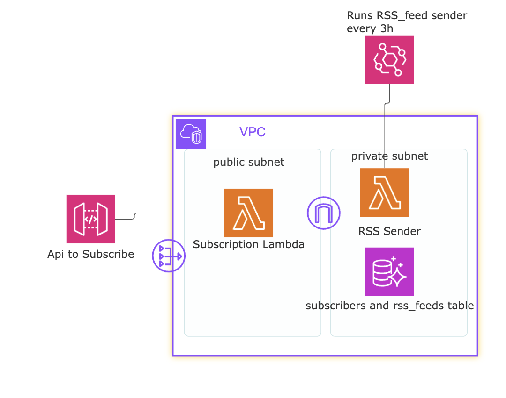

# VendexLabs


## Overview
Current Iteration (V1.1) sends email notifications 

## Features
- **Infrastructure as Code (IaC)**: Terraform scripts to provision AWS resources.
- **Logging & Monitoring**: AWS CloudWatch integration.
- **Security Best Practices**: IAM roles, security groups, and encryption enabled.
- **Scalability**: Auto-scaling and load balancing configurations.

## Architecture
A simplified diagram of the main parts



## Getting Started
### Prerequisites
- AWS CLI installed and configured
- Terraform installed: https://developer.hashicorp.com/terraform/tutorials/aws-get-started

### Deployment Steps
1. Clone the repository:
   ```sh
   git clone https://github.com/hippyhippoyah/vendexlabs.git
   cd vendexlabs/
   ```
2. Create a terraform.tfvars file

```
db_user      = "your_info"
db_pass      = "your_info"
rss_feed_urls = ["https://feeds.feedburner.com/TheHackersNews?format=xml", 
"https://krebsonsecurity.com/feed/", "https://www.bleepingcomputer.com/feed/", 
"https://databreaches.net/feed/", "https://feeds.feedburner.com/eset/blog", 
"https://www.schneier.com/feed/atom/", "https://podcast.darknetdiaries.com/",]
api_key      = "ur_openai_key"
lambda_version = "your_version"
subscription_version = "your_version"
```
4. run terraform apply
5. You will need to connect to the bastion host (EC2 instance in public subnet) to initiallize the tables 
(Sorry I forgot to add to the diagram), you will need to run the query in rss_feeds.sql.  
6. To expose the lambda, configure your own API gateway and Cognito. Some lambdas like subscription manager require cognito and token parsing.


## Versions
V1.1: Added parsing for 8 feeds sending email to subscribers every 3h for their subscribed vendors. 
V1.2: Added dedupe handling

## Todo for next version
- Move Infra out of VPC to reduce costs ($35/month NAT gateway)
- Implement ORG manager endpoint
- Finish Vendor Analysis Page and Parsing of Information
- Restructure Lambdas to Add Admins, Orgs, and Tenants. (Currently only support for individuals and Tenants)
- Fix dedupe
- Still very much a WIP will clean up Repo before public (random files not needed and might be sensitive)